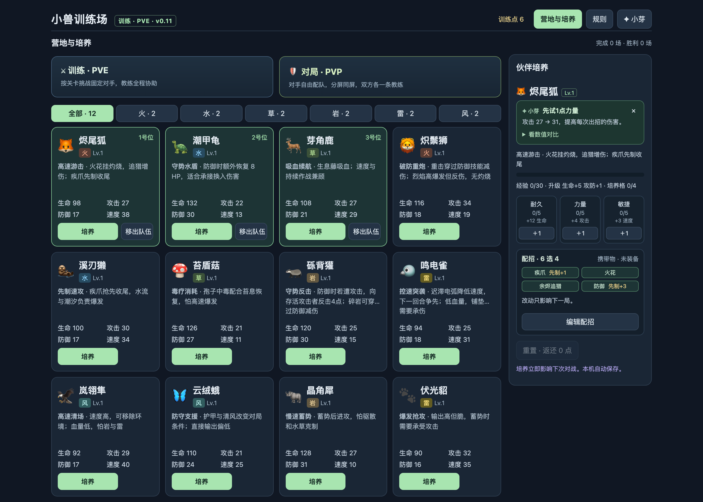
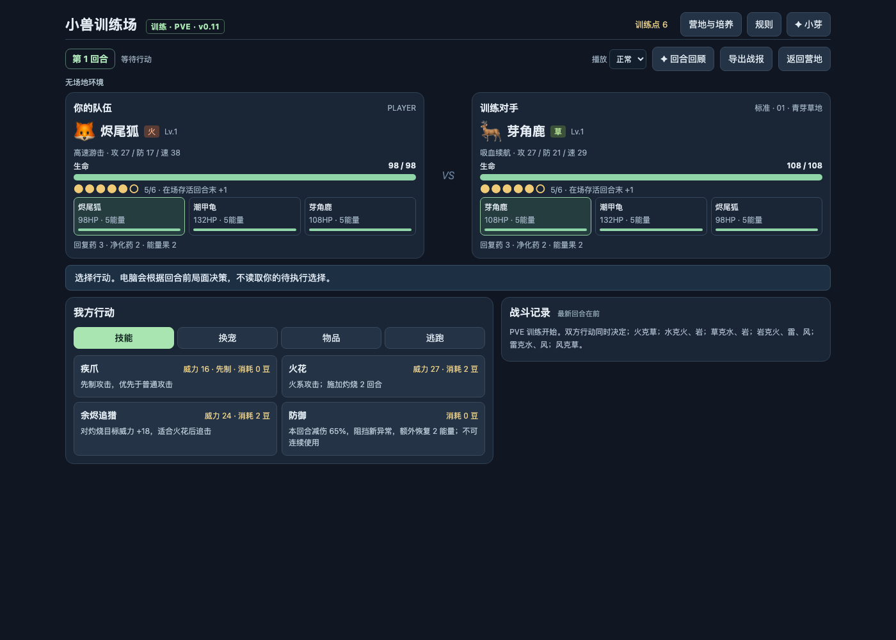

# 小兽训练场 · 小芽

一个宠物对战游戏，以及一个住在游戏里的 AI 教练。

为腾讯 IEG 面试题「基于 LLM 的智能 AI Coach」所做。规则引擎、对战、成长、UI 都从零写，**没有第三方 npm 依赖**——`npm start` 就能玩。



---

## 运行

需要 Node.js 20+。

```sh
npm start          # http://127.0.0.1:8765/
npm test           # 257 项，约 12 秒
```

**不接模型也能完整游玩**：规则建议、复盘、培养建议和小测都由本地引擎给出。接上模型之后，这些解释改由模型生成。

想接模型，在 http://127.0.0.1:8765/connect.html 填入 DeepSeek API Key（只留在服务端进程内存里，不落盘、不写日志）。也可以用 macOS 钥匙串启动：

```sh
./scripts/start.sh --save-key   # 存一次
./scripts/start.sh              # 以后直接启动，自动读取
```

---

## 三种角色

| | 做什么 | 怎么出现 |
|---|---|---|
| **军师** | 准确且可解释的决策建议 | 顶部一句话，「看看原因」展开依据 |
| **老师** | 复盘、讲解、循序渐进 | 整局结束后的复盘与阶段小测 |
| **陪练** | 记得你、有情绪、会吐槽 | 左下角独立气泡，带头像与名字 |

三种角色都做成了可运行的闭环，不是只有设计。



---

## 一句话说清设计

**把「算」和「说」分开——引擎负责对，模型负责讲。**

伤害、克制、命中、胜负一律由引擎算；模型只负责把已经算好的结论说成人话。所有取舍都是这条的推论：

- 模型不参与伤害计算，也不决定对手出招
- 「该不该调工具」由代码判断，不由模型自由发挥
- 模型说出的话要经过三条校验，越界就回退到本地模板

同一个道理在开发过程里又验证了一次：**助手负责产出，我负责验收**。它交付过多次「测试全绿但功能没生效」的东西——详见报告第 3 节。

---

## 目录

- **`output/pdf/xiaoya-coach-report.pdf`** — 实施与实验报告（8 页，建议先看这个）
- `docs/CHECKLIST.md` — 逐项完成状态与验收证据
- `docs/IMPLEMENTATION-STATUS.md` — 当前能力、运行版本与限制
- `docs/DEMO-ACCEPTANCE.md` — 普通游玩、静默、条件提醒、异步与公平性演示
- `docs/EXPERIMENTS.md` — 完整实验与资源边界
- `docs/INTERVIEW-GUIDE.md` — 讲述与追问准备
- `docs/EVIDENCE-SCHEMA.md` — 事件、证据、任务状态与权限约定

---

## 实验

```sh
npm run build:knowledge      # 从 tactics.json 与引擎生成知识卡
npm run eval:retrieval       # 检索四臂对照
npm run eval:balance         # 平衡矩阵（约 3 分钟）
npm run train:intervention   # Q-learning 干预时机
```

产物写在 `reports/`。真实模型联调用 `node scripts/eval-live-model.js`，会消耗少量 API 额度，不读取也不打印密钥。

实验有两条：Q-learning 学干预时机；SmolLM2 冻结骨干后训练两个工具输出行，实际更新 1152 个参数。后者是小型二选一实验，**不是 DeepSeek 微调**。

---

## 边界

**本地对战是同一台设备分屏同屏，不是联网 PVP。** 服务端仍接受客户端提交的快照，不是权威状态；客户端快照不构成生产环境的权限边界。

一回合搜索不是全局最优。浏览器语音已停用——在本机 macOS Chrome 上，无论指定哪个 zh-CN 声音都会播成粤语并伴随结尾爆音，触发点是 `speechSynthesis.cancel()`；代码保留在 `VOICE_FEATURE` 开关后，查明原因前不宣称有语音能力。上下文先保守裁剪，再用官方 tokenizer 计数。

真人学习收益、完整多步 LLM 训练、生产权限认证与独立大样本评测尚未完成。

---

## 可选：本地模型

基础游戏只需 Node。语义检索、精确 token 计数和训练需要 Python。

```sh
node scripts/eval-semantic.js
node scripts/eval-balance.js
.venv-agent/bin/python scripts/train-tool-router.py
```

首个模型需要联网下载；启动时预热语义模型，未就绪会自动退回词项检索。

---

## 存档

成长、偏好、会话与最近 3 场完整对局存在本机 localStorage。刷新可以复盘，但不会把进行中的对战恢复到可继续操作的状态——旧版没存下来的历史无法补造。教练事件最多 240 条；清除记忆会同时删除教练档案，游戏成长保留。预制体验不写真实进度。
